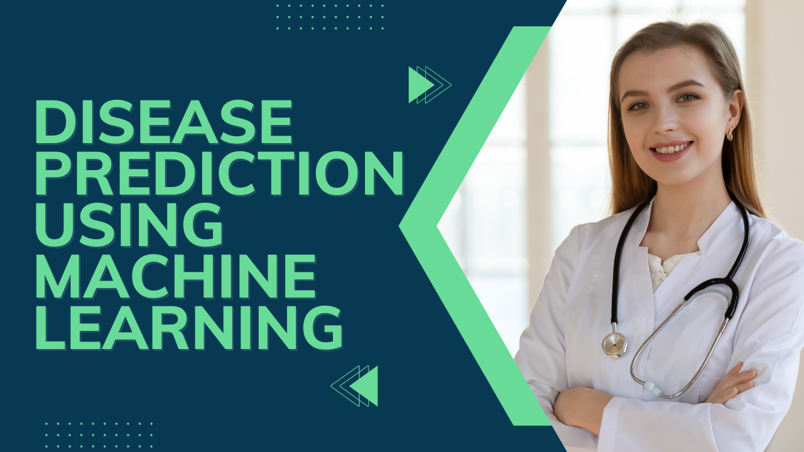

<!-- PROJECT TITLE -->
<div>
  <h1 align="center",style="bold">
    GUARDIAN HEALTH
  </h1>
  <h6 align="center">
    A Machine Learning-Based Disease Prediction System
  </h6>
  <hr>
</div>
  <h1 align="center">Hi there, I'm Mr Akash 👋</h1>
<h3 align="center">Enthusiastic Data Science Student </h3>

<p align="center">
  <a href="https://www.linkedin.com/in/akash-gujju-1aa7a3264/"></a>
  <a href="mailto:akashgujju05@gmail.com"></a>
</p>
<hr

<h2>Overview</h2>
Healthcare diagnostics face challenges such as delays, inaccessibility, and occasional errors. "Guardian Health" leverages machine learning to address these issues by predicting diseases based on user-provided symptoms. Our system simplifies healthcare decision-making by offering an accessible and accurate diagnostic tool.

<h2>What Our Project Does</h2>

Guardian Health empowers users with a machine learning-based disease prediction system. By analyzing symptoms, it offers predictions to support early detection and informed healthcare decisions. 

Key objectives include:
- Enhancing diagnostic accuracy using machine learning.
- Providing an intuitive interface for users to input symptoms.
- Ensuring data security and ethical handling of sensitive health information.
- Continuously improving prediction accuracy using user feedback.



<h2>Introduction</h2>
The urgency for accurate and swift healthcare diagnostics is undeniable. Guardian Health bridges the gap between traditional diagnosis methods and advanced machine learning techniques. By focusing on disease prediction, this system helps in early detection and timely intervention, reducing diagnostic errors and saving valuable time.

<h2>Problem Definition</h2>
Traditional methods of diagnosing diseases rely heavily on manual interpretation of symptoms, which can lead to:
- Delays in diagnosis.
- Barriers to access due to geographical or financial constraints.
- Increased risk of diagnostic errors.

Guardian Health addresses these challenges by:
1. Utilizing machine learning models for accurate disease predictions.
2. Providing an accessible platform for all users.
3. Ensuring robust data security and privacy.

<h2>Machine Learning Models Used</h2>

The project incorporates the following machine learning algorithms:
1. **Decision Tree**: For interpretable disease classification.
2. **Random Forest**: To enhance accuracy through ensemble learning.
3. **K-Nearest Neighbor (KNN)**: For pattern matching based on user symptoms.
4. **Naive Bayes**: For probabilistic disease prediction.

<h2>Key Features</h2>

1. **Symptom Input Form**: Easy-to-use interface for entering symptoms.
2. **Disease Prediction**: Accurate predictions based on trained machine learning models.
3. **Feedback Integration**: Continuous refinement through user feedback.
4. **Secure Data Handling**: Robust measures to protect sensitive health information.

<h2>Technologies Used</h2>

<div class="flex">
  
  
  
  
</div>

<h2>How to Setup</h2>

1. Clone the repository:
   ```bash
   git clone <https://github.com/mr-akash05/Guardian-Health.git>
2. Install dependencies:
   ```bash
   pip install -r requirements.txt
3. Open the Jupyter Notebook:
   ```bash
   jupyter notebook
4. Load the Training.csv and Testing.csv datasets provided.
5. Execute the notebook cells to train models and make predictions.
   
<h2>Dataset</h2>

**Training Dataset**: Contains symptom-disease mappings for training the machine learning models.

**Testing Dataset** : Used to evaluate the model's prediction accuracy. 

<h2>Project Screenshots</h2>

**Home Page:**


**Symptom Input Form:**

.png)


**Prediction Output:**


<h2>About us</h2>

### Team Members 

1. Akash Gujju ([@akash-gujju](https://www.linkedin.com/in/akash-gujju-1aa7a3264/))
2. Yaswanth Sai
3. Chandu Ummanaveni

We created Guardian Health to improve healthcare accessibility and efficiency. By combining our passion for technology and healthcare, we aim to provide a tool that can make a difference in people's lives.

<h2>Future Enhancements</h2>

1. Expanding the dataset for better model generalization.
2. Incorporating deep learning techniques for improved predictions.
3. Enhancing the user interface with additional accessibility features.
4. Adding multilingual support for broader reach.
